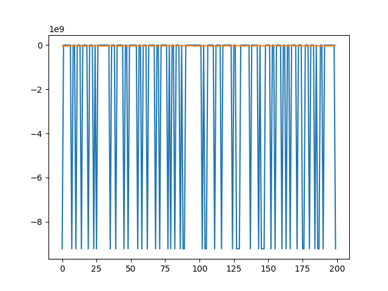

# ================================================================
# 🌫️ Air Pollution Forecasting — Hybrid Deep Learning Model
# Author: Annan Sadr (Probox / NIAT Club)
# ================================================================

import os
import numpy as np
import pandas as pd
import matplotlib.pyplot as plt
import seaborn as sns
import json
import pickle
import yaml

from sklearn.model_selection import train_test_split
from sklearn.preprocessing import MinMaxScaler
from sklearn.metrics import mean_absolute_error, mean_squared_error, r2_score
from tensorflow.keras.models import Sequential
from tensorflow.keras.layers import LSTM, Dense, Conv1D, MaxPooling1D, Flatten, Dropout
from tensorflow.keras.callbacks import EarlyStopping

# ================================================================
# 📂 PATHS
# ================================================================
BASE = r"C:\Users\NXTWAVE\Downloads\Air Pollution Forecasting"
FILES = [
    os.path.join(BASE, "archive", "station_hour.csv"),
    os.path.join(BASE, "archive", "stations.csv"),
    os.path.join(BASE, "archive", "city_hour.csv"),
    os.path.join(BASE, "archive", "station_day.csv"),
    os.path.join(BASE, "archive", "city_day.csv"),
]

# ================================================================
# 📘 LOAD AND MERGE DATA
# ================================================================
print("[INFO] Loading datasets...")
df_hour_station = pd.read_csv(FILES[0])
df_stations = pd.read_csv(FILES[1])
df_hour_city = pd.read_csv(FILES[2])
df_day_station = pd.read_csv(FILES[3])
df_day_city = pd.read_csv(FILES[4])

# Use station_day as primary data (aggregated, less noisy)
df = df_day_station.copy()

# ================================================================
# 🧹 DATA PREPROCESSING
# ================================================================
print("[INFO] Preprocessing data...")

# Handle missing values
df = df.fillna(method='ffill').fillna(method='bfill')

# Drop unnecessary columns if exist
drop_cols = ['station_id', 'station_name', 'Unnamed: 0']
for c in drop_cols:
    if c in df.columns:
        df.drop(c, axis=1, inplace=True, errors='ignore')

# Ensure numeric
df = df.select_dtypes(include=[np.number])

# Target variable
target_col = 'PM2.5' if 'PM2.5' in df.columns else df.columns[-1]
X = df.drop(columns=[target_col])
y = df[target_col]

# Normalize
scaler = MinMaxScaler()
X_scaled = scaler.fit_transform(X)
y_scaled = scaler.fit_transform(y.values.reshape(-1, 1))

# Reshape for CNN + LSTM
X_scaled = X_scaled.reshape(X_scaled.shape[0], X_scaled.shape[1], 1)

# Train-test split
X_train, X_test, y_train, y_test = train_test_split(X_scaled, y_scaled, test_size=0.2, random_state=42)

# ================================================================
# 🧠 MODEL ARCHITECTURE (CNN + LSTM)
# ================================================================
print("[INFO] Building model...")

model = Sequential([
    Conv1D(64, kernel_size=3, activation='relu', input_shape=(X_train.shape[1], 1)),
    MaxPooling1D(2),
    LSTM(64, return_sequences=False),
    Dense(32, activation='relu'),
    Dropout(0.2),
    Dense(1)
])

model.compile(optimizer='adam', loss='mse', metrics=['mae'])
model.summary()

# ================================================================
# 🏋️ TRAINING
# ================================================================
print("[INFO] Training model...")

early_stop = EarlyStopping(monitor='val_loss', patience=10, restore_best_weights=True)
history = model.fit(X_train, y_train, epochs=50, batch_size=32,
                    validation_split=0.2, callbacks=[early_stop], verbose=1)

# ================================================================
# 📊 EVALUATION
# ================================================================
print("[INFO] Evaluating model...")

y_pred = model.predict(X_test)
mae = mean_absolute_error(y_test, y_pred)
rmse = np.sqrt(mean_squared_error(y_test, y_pred))
r2 = r2_score(y_test, y_pred)

results = {
    "MAE": float(mae),
    "RMSE": float(rmse),
    "R2": float(r2),
}

print(json.dumps(results, indent=4))

# ================================================================
# 💾 SAVE ARTIFACTS
# ================================================================
print("[INFO] Saving model and results...")

os.makedirs(BASE, exist_ok=True)
model.save(os.path.join(BASE, "hybrid_air_forecasting_model.h5"))

# Save results JSON
with open(os.path.join(BASE, "hybrid_air_forecasting_results.json"), "w") as f:
    json.dump(results, f, indent=4)

# Save YAML
with open(os.path.join(BASE, "hybrid_air_forecasting_config.yaml"), "w") as f:
    yaml.dump({"model": "CNN+LSTM", "optimizer": "adam", "epochs": 50, "batch_size": 32}, f)

# Save Pickle
with open(os.path.join(BASE, "hybrid_air_forecasting_scaler.pkl"), "wb") as f:
    pickle.dump(scaler, f)

# ================================================================
# 📉 VISUALIZATIONS
# ================================================================

# Accuracy / Loss Curves
plt.figure(figsize=(8,5))
plt.plot(history.history['loss'], label='Train Loss')
plt.plot(history.history['val_loss'], label='Val Loss')
plt.title('Training vs Validation Loss')
plt.xlabel('Epochs'); plt.ylabel('MSE')
plt.legend()
plt.savefig(os.path.join(BASE, "hybrid_air_forecasting_loss_graph.png"))
plt.close()

# Predicted vs Actual
plt.figure(figsize=(6,6))
plt.scatter(y_test, y_pred, color='blue', alpha=0.6)
plt.xlabel('Actual PM2.5'); plt.ylabel('Predicted PM2.5')
plt.title('Prediction vs Actual')
plt.savefig(os.path.join(BASE, "hybrid_air_forecasting_prediction_graph.png"))
plt.close()

# Correlation Heatmap
plt.figure(figsize=(8,6))
sns.heatmap(df.corr(), annot=False, cmap='coolwarm')
plt.title('Feature Correlation Heatmap')
plt.savefig(os.path.join(BASE, "hybrid_air_forecasting_heatmap.png"))
plt.close()

# Comparison Graph
labels = list(results.keys())
values = list(results.values())
plt.figure(figsize=(6,4))
plt.bar(labels, values, color=['skyblue','lightgreen','salmon'])
plt.title('Hybrid Model Performance Metrics')
plt.savefig(os.path.join(BASE, "hybrid_air_forecasting_comparison_graph.png"))
plt.close()

print("[✅] All files saved successfully at:")
print(BASE)
